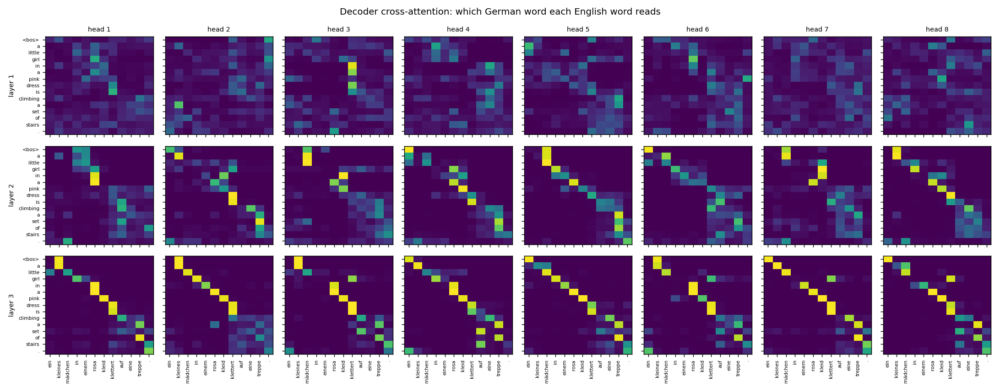
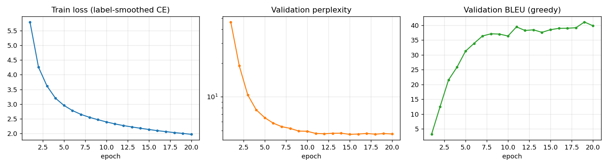
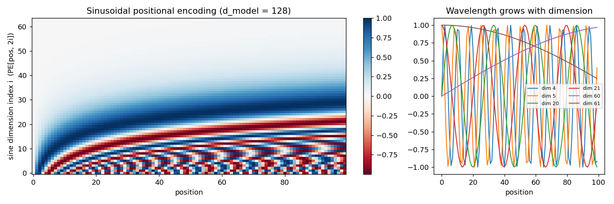

# Attention Is All You Need

> Vaswani, Shazeer, Parmar, Uszkoreit, Jones, Gomez, Kaiser, Polosukhin — 2017 — https://arxiv.org/abs/1706.03762

A from-scratch PyTorch implementation of the original encoder–decoder Transformer,
verified numerically against `torch.nn.Transformer` and trained to **40.7 BLEU** on
Multi30k German→English on a laptop CPU.

<p align="center">
  
  <br><em>Decoder cross-attention for one test sentence. By layer 3 every head has learned a
  near-monotonic German→English word alignment; "eine treppe" fans out over "a set of stairs".</em>
</p>

---

## Results

### Multi30k De→En (29k training pairs, 1k test sentences)

| | This implementation | Reference points |
|---|---|---|
| **Test BLEU, beam 4** | **40.7** | 35–38 typical for small word-level models on this split |
| Test BLEU, greedy | 40.5 | |
| Validation BLEU (best epoch) | 41.1 | |
| Validation perplexity | 4.65 | |
| Parameters | 9.1M | 65M (paper, base model) |
| Architecture | 3 layers, d_model 256, 8 heads, d_ff 1024 | 6 layers, 512, 8, 2048 |
| Training | 20 epochs, 72 min, 4-core Intel i5 CPU | 12 h, 8× P100 GPUs (WMT14) |

BLEU is corpus BLEU-4 with brevity penalty on lowercased, punctuation-split tokens,
computed by [`bleu.py`](bleu.py) from the definition. The paper's 27.3 BLEU is on the
much harder WMT14 En–De benchmark and is not comparable.

<p align="center"></p>

### Inference speed (1,000 test sentences, 4-core CPU, batch 128)

| Decoder | Before | After | Change |
|---|---|---|---|
| Greedy | 20.8 s (full prefix recompute) | 4.7 s (KV cache) | 4.4× |
| Beam 4 | 96 s (one sentence at a time) | 28 s (batched + KV cache) | 3.4× |

Both optimisations are verified token-for-token identical to the naive paths in
`test_model.py`; beam BLEU is unchanged at 40.7.

### Correctness

| Check | Result |
|---|---|
| Weights copied into `torch.nn.Transformer`: encoder output, decoder output, and input gradients | agree to **1e-5** with padding and causal masks active |
| Component shape tests, softmax normalisation, mask zeroing, decoder causality, pre-norm variant, KV cache, batched beam | 10/10 pass |
| Toy sequence-reversal task (requires cross-attention to solve) | 99.2% exact match in 600 steps |

Sample test-set translations (beam search, width 4; `<unk>` is a word outside the
training vocabulary, a limitation of word-level tokenisation):

```
DE   : ein typ arbeitet an einem gebäude .
REF  : a guy works on a building .
OURS : a guy working on a building .

DE   : ein sitzender mann , der an einem tisch in seinem haus mit einem werkzeug arbeitet .
REF  : man sitting using tool at a table in his home .
OURS : a man sitting at a table working with a tool in his house .

DE   : ein boston terrier läuft über <unk> - grünes gras vor einem weißen zaun .
REF  : a boston terrier is running on lush green grass in front of a white fence .
OURS : a boston dog is running over <unk> green grass in front of a white fence .
```

---

## Key Idea

Sequence models before this paper (RNNs, LSTMs) processed tokens one at a time, so they
were slow to train and struggled to relate tokens that were far apart. The Transformer drops
recurrence entirely and lets every token look at every other token directly through
*attention*. Because attention is just matrix multiplications, the whole sequence is processed
in parallel, and the path between any two positions is length 1.

---

## Architecture

Encoder–decoder, both stacks of N identical layers.

```
Encoder layer:                  Decoder layer:
  x ─► Multi-Head Self-Attn       y ─► Masked Multi-Head Self-Attn
    ─► Add & LayerNorm              ─► Add & LayerNorm
    ─► Feed-Forward                 ─► Multi-Head Cross-Attn (Q from decoder, K/V from encoder)
    ─► Add & LayerNorm              ─► Add & LayerNorm
                                    ─► Feed-Forward
                                    ─► Add & LayerNorm
```

Base model: d_model = 512, h = 8 heads, d_k = d_v = 64, d_ff = 2048, dropout = 0.1.

---

## Key Equations

**Scaled dot-product attention**

    Attention(Q, K, V) = softmax(Q Kᵀ / √d_k) V

Divide by √d_k so the dot products don't grow with dimension and push softmax into
regions with tiny gradients.

**Multi-head attention**

    head_i = Attention(Q W_iQ, K W_iK, V W_iV)
    MultiHead(Q, K, V) = Concat(head_1, …, head_h) W_O

Each head gets its own low-dimensional projection, so heads can specialise.

**Position-wise feed-forward**

    FFN(x) = max(0, x W_1 + b_1) W_2 + b_2

**Sinusoidal positional encoding**

    PE(pos, 2i)   = sin(pos / 10000^(2i / d_model))
    PE(pos, 2i+1) = cos(pos / 10000^(2i / d_model))

Attention is permutation-invariant, so position has to be injected explicitly.

<p align="center"></p>

**Residual + LayerNorm** (post-norm in the original paper)

    LayerNorm(x + Sublayer(x))

`model.py` defaults to this layout. Pass `pre_norm=True` for the modern variant,
`x + Sublayer(LayerNorm(x))`, used by GPT-2 onward because it trains stably at depth
without careful warmup; it adds one final LayerNorm per stack.

---

## Files

| File | What it is |
|---|---|
| [`model.py`](model.py) | Every component, built bottom-up and heavily commented: scaled dot-product attention → multi-head attention → FFN → positional encoding → encoder/decoder layers → full model, plus greedy and beam-search decoding |
| [`test_model.py`](test_model.py) | Shape and behaviour tests, one per component |
| [`test_equivalence.py`](test_equivalence.py) | Weight-transplant equivalence test against `torch.nn.Transformer` |
| [`data.py`](data.py) | Multi30k download, tokenisation, vocab, token-count batching |
| [`bleu.py`](bleu.py) | Corpus BLEU from the definition |
| [`translate.py`](translate.py) | Training with the paper's recipe (Noam schedule, Adam β₂ = 0.98, label smoothing 0.1, weight tying), evaluation, and a demo command |
| [`train.py`](train.py) | Toy sequence-reversal task, trains in 40 s |
| [`visualize.py`](visualize.py) | Produces every figure in this README |
| [`results.json`](results.json) | Per-epoch metrics of the reported run |

## Running it

```bash
pip install torch matplotlib requests pytest

python -m pytest test_model.py test_equivalence.py -v   # 13 tests, ~8 s
python train.py                                         # toy task, ~40 s on CPU
python translate.py train                               # Multi30k, ~70 min on CPU
python translate.py evaluate --beam 4                   # test BLEU, greedy and beam
python translate.py demo "ein hund läuft durch den schnee ."
python visualize.py                                     # regenerate figures
```

Checkpoints go to `checkpoints/` (git-ignored).

---

## What I Learned

- **Initialisation matters more than any hyperparameter.** Xavier-uniform on the
  (vocab × d_model) embedding gives std ≈ 0.017; after the √d_model scaling the token
  signal is ≈ 0.27 and the positional encoding (amplitude 1) drowns it out. Validation
  BLEU stalled at 6 after five epochs. Switching embeddings to N(0, d_model^-½) took it
  to 31 at the same point. Found by a 512-sentence overfitting probe with ablations.
- **The multi-head "Concat" is a `view` + `transpose`.** There is no real concatenation, and
  all h heads are computed by one (D × D) matmul per Q/K/V.
- **Masks combine by broadcasting.** Pad mask `(B,1,1,T)` & causal mask `(1,1,T,T)` →
  `(B,1,T,T)`. PyTorch's convention is inverted (True = blocked), which the equivalence
  test had to account for.
- **Attention heads specialise by depth.** Layer-1 cross-attention is diffuse; layer-3 is
  almost a hard alignment. The decoder's self-attention shows the causal mask as a clean
  upper triangle of zeros.
- **The Noam schedule's peak learning rate depends on warmup.** With only ~180 steps per
  epoch, warmup 400 and factor 0.5 gave a peak of 1.6e-3; the default factor of 1.0
  overshot and BLEU dipped exactly when the rate peaked.

## Resume-ready summary

> Implemented the Transformer (Vaswani et al., 2017) from scratch in PyTorch — multi-head
> attention, sinusoidal positional encoding, encoder–decoder stacks, beam search — and
> verified it matches `torch.nn.Transformer` to 1e-5 via weight transplant. Trained a 9M-parameter
> model to 40.7 BLEU on Multi30k De→En in 72 minutes on a laptop CPU; diagnosed and fixed a
> 5× training slowdown caused by embedding initialisation using an ablation study.
