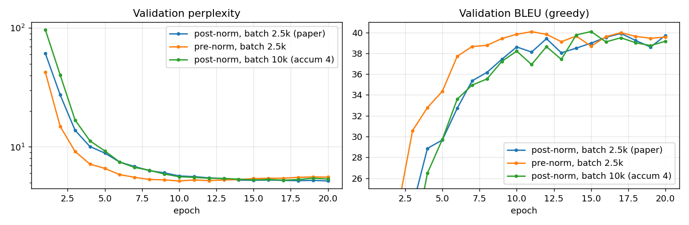
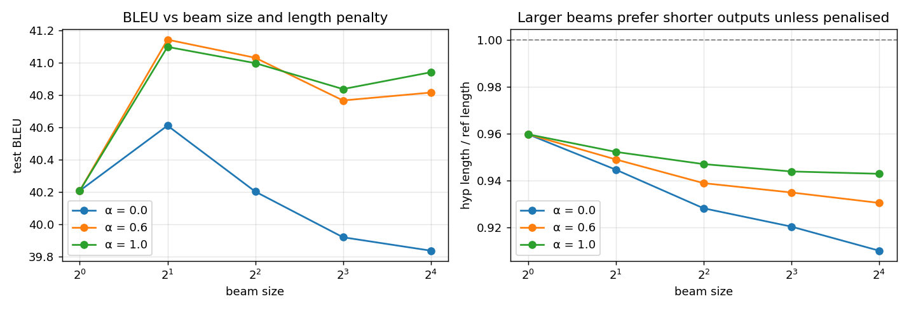

# Attention Is All You Need

> Vaswani, Shazeer, Parmar, Uszkoreit, Jones, Gomez, Kaiser, Polosukhin — 2017 — https://arxiv.org/abs/1706.03762

A from-scratch PyTorch implementation of the original encoder–decoder Transformer,
verified numerically against `torch.nn.Transformer` and trained to **41.0 BLEU** on
Multi30k German→English on a laptop CPU, with from-scratch byte-pair encoding and
checkpoint averaging on top of the paper's recipe.

<p align="center">
  
  <br><em>Decoder cross-attention for one test sentence. By layer 3 every head has learned a
  near-monotonic German→English word alignment; "eine treppe" fans out over "a set of stairs".</em>
</p>

---

## Results

### Multi30k De→En (29k training pairs, 1k test sentences)

| | This implementation | Reference points |
|---|---|---|
| **Test BLEU, BPE + 5-checkpoint average, beam 4** | **41.0** | 35–38 typical for small models on this split |
| Test BLEU, word-level, beam 4 | 40.7 | |
| Test BLEU, word-level, greedy | 40.5 | |
| Validation BLEU (word-level, best epoch) | 41.1 | |
| Validation perplexity (word-level) | 4.65 | |
| Parameters | 9.1M | 65M (paper, base model) |
| Architecture | 3 layers, d_model 256, 8 heads, d_ff 1024 | 6 layers, 512, 8, 2048 |
| Training | 20 epochs, 72 min, 4-core Intel i5 CPU | 12 h, 8× P100 GPUs (WMT14) |

BLEU is corpus BLEU-4 with brevity penalty on lowercased, punctuation-split tokens,
computed by [`bleu.py`](bleu.py) from the definition. The paper's 27.3 BLEU is on the
much harder WMT14 En–De benchmark and is not comparable.

<p align="center"></p>

### Tokenisation and checkpoint averaging

| Model | Test BLEU, greedy | Test BLEU, beam 4 | `<unk>` in test source |
|---|---|---|---|
| Word-level, best checkpoint | 40.5 | 40.7 | 3.55% of tokens |
| BPE (8k joint merges), best checkpoint | 39.6 | 40.1 | 0 |
| **BPE, average of epochs 16–20** | 40.2 | **41.0** | 0 |

Two of the paper's ingredients that the first run skipped. [`bpe.py`](bpe.py) is byte-pair
encoding written from scratch (Sennrich et al., 2016; the paper uses a 37k shared BPE
vocabulary); [`average_checkpoints.py`](average_checkpoints.py) is the Section 6.1 trick of
averaging the last five checkpoints.

- **BPE alone did not raise BLEU here.** On 29k training sentences the word-level vocabulary
  already covers 96% of test tokens, and BPE sequences are ~13% longer, so per-epoch
  progress is a little slower. What BPE fixes is the failure mode, not the average: every
  sentence that contained an `<unk>` now translates. *"der etwas anstarrt"* went from
  `<unk> something` to *staring at something*.
- **Checkpoint averaging is worth about a point.** Same model, no extra training: 40.1 → 41.0
  BLEU with beam search. Late in a decaying-learning-rate schedule the weights orbit a good
  basin; the mean of five orbits sits closer to its centre than any one of them.

```
DE   : ein mann mit einem orangefarbenen hut , der etwas anstarrt .
REF  : a man in an orange hat starring at something .
BPE  : a man in an orange hat staring at something .

DE   : ein mädchen in einem karateanzug bricht ein brett mit einem tritt .
REF  : a girl in karate uniform breaking a stick with a front kick .
BPE  : a girl in a karate uniform is crashing a board with a kick .
```

### Three training runs, same data and budget

Each is 20 epochs of the BPE setup, differing in one thing.

| Run | Optimizer steps/epoch | Val BLEU @ epoch 3 / 6 / 10 | Best val BLEU (epoch) | Test BLEU, best ckpt | Test BLEU, avg of 16–20 |
|---|---|---|---|---|---|
| Post-norm, 2.5k-token batches (paper) | 204 | 23.3 / 32.7 / 38.6 | 39.9 (17) | 40.1 | **41.0** |
| Pre-norm, 2.5k-token batches | 204 | 30.6 / 37.7 / 39.8 | 40.1 (11) | 40.3 | 40.6 |
| Post-norm, 10k-token batches (accumulate 4) | 51 | 19.2 / 33.6 / 38.2 | 40.1 (15) | 40.3 | 39.8 |

Test BLEU is beam 4. The accumulation run uses `--accum-steps 4`, which runs four
minibatches before each optimizer step, so the effective batch is 10k tokens, closer to
the ~25k the paper uses (Section 5.1). Its warmup is scaled by the same factor (400 → 100),
which lands the Noam peak learning rate at twice the baseline's, the square-root scaling
a 4× batch wants.

<p align="center"></p>

- **Pre-norm gets there faster.** It is 5–7 BLEU ahead through the first six epochs and
  reaches its best validation score at epoch 11 instead of 17. That is the Xiong et al. (2020)
  result: with the residual stream un-normalised, gradients at initialisation are well scaled
  and the model does not depend on warmup to survive its first steps.
- **It does not get further.** Both layouts plateau at about 40 validation BLEU, and
  pre-norm's validation perplexity starts creeping up after epoch 14, so its last-5 average
  gains less (40.3 → 40.6) than post-norm's did (40.1 → 41.0). On a 29k-sentence corpus the
  bottleneck is data, not optimisation; pre-norm's advantage is the training budget it saves.
- **Bigger batches did not help.** The 4× effective batch starts slower (19.2 BLEU at
  epoch 3 against the baseline's 23.3, with a quarter as many optimizer steps behind it),
  catches up by epoch 6, and peaks marginally higher and two epochs earlier (40.1 at 15 vs
  39.9 at 17). But it is the worst of the three after checkpoint averaging (39.8 vs 41.0):
  its validation BLEU declines after epoch 15, so the fixed "average the last five" window
  sits past the peak. Throughput was
  unchanged: a batch-size sweep from 1k to 10k tokens per forward pass moved training
  between 2,250 and 2,357 tok/s, so on this machine accumulation costs nothing and buys
  nothing. Large-batch training is a distributed-GPU concern, and this corpus is too small
  to need it.
- **Averaging and the learning-rate schedule interact.** Both runs that peaked early
  (pre-norm at 11, accumulation at 15) gained less from averaging than the run that peaked
  at 17. Averaging a fixed last-N window assumes training is still in its plateau; when it
  is not, the window straddles the decline.
- **Tried and rejected: int8 dynamic quantization.** `torch.quantization.quantize_dynamic` on
  the Linear layers shrinks the weights 42.8 → 27.4 MB but gave no decode speedup on this
  i5 (no VNNI) at batch 128 and cost 0.36 BLEU (41.03 → 40.67), so it is not used. The
  attention module tolerates it if you want to try on a CPU with int8 acceleration.

### Beam size and length penalty ([`decode_sweep.py`](decode_sweep.py), BPE-averaged model)

| beam | α = 0 (no penalty) | α = 0.6 (paper) | α = 1.0 |
|---|---|---|---|
| 1 (greedy) | 40.21 | | |
| 2 | 40.61 | **41.14** | 41.10 |
| 4 | 40.20 | 41.03 | 41.00 |
| 8 | 39.92 | 40.77 | 40.84 |
| 16 | 39.84 | 40.82 | 40.94 |

<p align="center"></p>

- **Without a length penalty, a bigger beam is worse than greedy.** Raw log-probability
  favours short hypotheses (every extra token multiplies in a number below 1), and a wider
  beam is better at finding them: mean output length falls from 96% of the reference at
  beam 1 to 91% at beam 16, and BLEU's brevity penalty punishes it. This is the
  "beam search curse" of Koehn & Knowles (2017), reproduced here in one run.
- **The paper's α = 0.6 fixes it**, and the gain saturates at beam 2–4: 41.1 at beam 2,
  41.0 at beam 4. Beam 16 costs 5× the decode time of beam 4 for nothing.
- α = 1.0 is as good as 0.6 on this data, so the exact value is not delicate.

### Inference speed (1,000 test sentences, 4-core CPU, batch 128)

| Decoder | Before | After | Change |
|---|---|---|---|
| Greedy | 20.8 s (full prefix recompute) | 4.7 s (KV cache) → 2.2 s (+ fused attention, finished-row pruning, length-sorted batches) | 9.5× |
| Beam 4 | 96 s (one sentence at a time) | 28 s (batched + KV cache) → 9.0 s (+ fused attention, pruning, vectorised selection, sorted batches, one cross-attention cache per sentence) | 10.7× |

Beam search's cross-attention cache holds one row per *sentence* rather than one per beam:
the K beams of a sentence all read the same encoder output, so they fold into the query
axis instead of duplicating the keys and values. For batch 128 × beam 4 that is 29 MB
instead of 116 MB.

Every step is verified token-for-token identical to the naive path in `test_model.py`;
BLEU is unchanged by any of them. The second-stage numbers are scaled from an interleaved
A/B taken while another job shared the CPU (greedy 7.9 → 3.7 s, beam 31 → 12.4 s).

### Throughput ([`bench.py`](bench.py), 3-layer d = 256 model, real Multi30k batches)

| Change | Train, target tok/s | Greedy inference, sentences/s |
|---|---|---|
| Separate Q/K/V layers, own attention | 2,233 | 163 |
| **Fused (3D × D) QKV projection + `F.scaled_dot_product_attention`** | **2,986** | **323** |

| `torch.set_num_threads` | Train tok/s | Inference sent/s |
|---|---|---|
| 1 | 1,123 | 165 |
| 2 | 2,110 | 275 |
| **4 (physical cores, torch's default)** | **2,986** | 323 |
| 8 (hyperthreads) | 2,556 | 332 |

The fused projection turns three matmuls into one for self-attention and two for
cross-attention; the fused kernel skips materialising the (B, H, T, S) weight tensor. Both
paths give bit-identical BLEU, and the reference attention is kept behind `set_store_attn`
for the heatmaps. Hyperthreads do not help a matmul-bound workload: two threads fighting
over one core's FMA units cost 14% on training. Numbers are from one machine, an Intel
i5-1038NG7, and will differ elsewhere; `python bench.py --threads 1 2 4 8` reproduces them.

### Correctness

| Check | Result |
|---|---|
| Weights copied into `torch.nn.Transformer`: encoder output, decoder output, and input gradients | agree to **1e-5** with padding and causal masks active |
| Component shape tests, softmax normalisation, mask zeroing, decoder causality, pre-norm variant, KV cache, batched beam | 10/10 pass |
| Toy sequence-reversal task (requires cross-attention to solve) | 99.2% exact match in 600 steps |

Sample test-set translations (beam search, width 4; `<unk>` is a word outside the
training vocabulary, a limitation of word-level tokenisation):

```
DE   : ein typ arbeitet an einem gebäude .
REF  : a guy works on a building .
OURS : a guy working on a building .

DE   : ein sitzender mann , der an einem tisch in seinem haus mit einem werkzeug arbeitet .
REF  : man sitting using tool at a table in his home .
OURS : a man sitting at a table working with a tool in his house .

DE   : ein boston terrier läuft über <unk> - grünes gras vor einem weißen zaun .
REF  : a boston terrier is running on lush green grass in front of a white fence .
OURS : a boston dog is running over <unk> green grass in front of a white fence .
```

---

## Key Idea

Sequence models before this paper (RNNs, LSTMs) processed tokens one at a time, so they
were slow to train and struggled to relate tokens that were far apart. The Transformer drops
recurrence entirely and lets every token look at every other token directly through
*attention*. Because attention is just matrix multiplications, the whole sequence is processed
in parallel, and the path between any two positions is length 1.

---

## Architecture

Encoder–decoder, both stacks of N identical layers.

```
Encoder layer:                  Decoder layer:
  x ─► Multi-Head Self-Attn       y ─► Masked Multi-Head Self-Attn
    ─► Add & LayerNorm              ─► Add & LayerNorm
    ─► Feed-Forward                 ─► Multi-Head Cross-Attn (Q from decoder, K/V from encoder)
    ─► Add & LayerNorm              ─► Add & LayerNorm
                                    ─► Feed-Forward
                                    ─► Add & LayerNorm
```

Base model: d_model = 512, h = 8 heads, d_k = d_v = 64, d_ff = 2048, dropout = 0.1.

---

## Key Equations

**Scaled dot-product attention**

    Attention(Q, K, V) = softmax(Q Kᵀ / √d_k) V

Divide by √d_k so the dot products don't grow with dimension and push softmax into
regions with tiny gradients.

**Multi-head attention**

    head_i = Attention(Q W_iQ, K W_iK, V W_iV)
    MultiHead(Q, K, V) = Concat(head_1, …, head_h) W_O

Each head gets its own low-dimensional projection, so heads can specialise.

**Position-wise feed-forward**

    FFN(x) = max(0, x W_1 + b_1) W_2 + b_2

**Sinusoidal positional encoding**

    PE(pos, 2i)   = sin(pos / 10000^(2i / d_model))
    PE(pos, 2i+1) = cos(pos / 10000^(2i / d_model))

Attention is permutation-invariant, so position has to be injected explicitly.

<p align="center"></p>

**Residual + LayerNorm** (post-norm in the original paper)

    LayerNorm(x + Sublayer(x))

`model.py` defaults to this layout. Pass `pre_norm=True` for the modern variant,
`x + Sublayer(LayerNorm(x))`, used by GPT-2 onward because it trains stably at depth
without careful warmup; it adds one final LayerNorm per stack.

---

## Files

| File | What it is |
|---|---|
| [`model.py`](model.py) | Every component, built bottom-up and heavily commented: scaled dot-product attention → multi-head attention → FFN → positional encoding → encoder/decoder layers → full model, plus greedy and beam-search decoding |
| [`test_model.py`](test_model.py) | Shape and behaviour tests, one per component; `test_bpe.py` and `test_average.py` cover the two new modules |
| [`test_equivalence.py`](test_equivalence.py) | Weight-transplant equivalence test against `torch.nn.Transformer` |
| [`data.py`](data.py) | Multi30k download, word or BPE tokenisation, vocab, token-count batching |
| [`bpe.py`](bpe.py) | Byte-pair encoding from scratch with an indexed learner (8k merges in 47 s) |
| [`average_checkpoints.py`](average_checkpoints.py) | Mean of the last N checkpoints (Section 6.1) |
| [`bleu.py`](bleu.py) | Corpus BLEU from the definition |
| [`bpe.py`](bpe.py) heap learner | 8k merges in 7.6 s (was 52 s); identical merges |
| Checkpoints | float16 storage, 47.4 → 23.8 MB, BLEU identical |
| [`bench.py`](bench.py) | Training and inference throughput, optionally across thread counts |
| [`decode_sweep.py`](decode_sweep.py) | BLEU and output length across beam sizes and length penalties |
| [`translate.py`](translate.py) | Training with the paper's recipe (Noam schedule, Adam β₂ = 0.98, label smoothing 0.1, weight tying), evaluation, and a demo command |
| [`train.py`](train.py) | Toy sequence-reversal task, trains in 40 s |
| [`notebook.ipynb`](notebook.ipynb) | Executed walkthrough: attention on a toy example, the √d_k effect, positional-encoding similarity, live translations, head entropy by layer, KV-cache timing, and a no-positional-encoding ablation |
| [`visualize.py`](visualize.py) | Produces every figure in this README |
| [`results.json`](results.json) | Per-epoch metrics of the reported run |

## Running it

```bash
pip install torch matplotlib requests pytest

python -m pytest -v                                    # 23 tests
python train.py                                         # toy task, ~40 s on CPU
python translate.py train                               # Multi30k word-level, ~70 min on CPU
python translate.py evaluate --beam 4                   # test BLEU, greedy and beam
python translate.py train --tokenizer bpe --keep-last 5 # BPE run, keeps epoch checkpoints
python average_checkpoints.py checkpoints/multi30k_bpe_epoch1[6-9].pt checkpoints/multi30k_bpe_epoch20.pt \
    --out checkpoints/multi30k_bpe_avg5.pt
python translate.py evaluate --tokenizer bpe --checkpoint checkpoints/multi30k_bpe_avg5.pt
python translate.py train --tokenizer bpe --pre-norm --variant prenorm --keep-last 5   # pre-norm comparison
python translate.py train --tokenizer bpe --accum-steps 4 --warmup 100 --variant accum4  # 10k-token batches
python translate.py demo "ein hund läuft durch den schnee ."
python visualize.py                                     # regenerate figures
```

Checkpoints go to `checkpoints/` (git-ignored).

---

## What I Learned

- **Initialisation matters more than any hyperparameter.** Xavier-uniform on the
  (vocab × d_model) embedding gives std ≈ 0.017; after the √d_model scaling the token
  signal is ≈ 0.27 and the positional encoding (amplitude 1) drowns it out. Validation
  BLEU stalled at 6 after five epochs. Switching embeddings to N(0, d_model^-½) took it
  to 31 at the same point. Found by a 512-sentence overfitting probe with ablations.
- **The multi-head "Concat" is a `view` + `transpose`.** There is no real concatenation, and
  all h heads are computed by one (D × D) matmul per Q/K/V.
- **Masks combine by broadcasting.** Pad mask `(B,1,1,T)` & causal mask `(1,1,T,T)` →
  `(B,1,T,T)`. PyTorch's convention is inverted (True = blocked), which the equivalence
  test had to account for.
- **Attention heads specialise by depth.** Layer-1 cross-attention is diffuse; layer-3 is
  almost a hard alignment. The decoder's self-attention shows the causal mask as a clean
  upper triangle of zeros.
- **Positional encoding is load-bearing.** Zeroing the PE buffer at inference (weights
  untouched) turns "a man is riding a bicycle" into "a man is riding a bike on a bike
  bike bike …": with no order signal, the decoder cannot tell which source words it has
  already covered. See the ablation in `notebook.ipynb`.
- **Cross-attention sharpens with depth.** Mean entropy drops from 1.83 nats (layer 1) to
  0.59 (layer 3) against a uniform baseline of 2.48.
- **Pre-norm buys speed, not ceiling.** Same final BLEU, reached in two-thirds of the
  epochs, and it overfits a little sooner. Worth it when compute is the constraint.
- **Beam search needs a length penalty more than it needs width.** Unpenalised, every
  beam size above 2 scored below greedy; with α = 0.6 the best result was beam 2. The
  decoder is well calibrated enough that width buys little, but short-output bias is real.
- **Fix the failure mode, then measure the average.** BPE didn't move BLEU on this corpus
  but removed every `<unk>`; checkpoint averaging moved BLEU by a point for zero training
  cost. Neither shows up in the loss curve, which is why the paper reports both separately.
- **The Noam schedule's peak learning rate depends on warmup.** With only ~180 steps per
  epoch, warmup 400 and factor 0.5 gave a peak of 1.6e-3; the default factor of 1.0
  overshot and BLEU dipped exactly when the rate peaked.

## Resume-ready summary

> Implemented the Transformer (Vaswani et al., 2017) from scratch in PyTorch — multi-head
> attention, sinusoidal positional encoding, encoder–decoder stacks, beam search — and
> verified it matches `torch.nn.Transformer` to 1e-5 via weight transplant. Trained a 9M-parameter
> model to 41.0 BLEU on Multi30k De→En on a laptop CPU with from-scratch byte-pair encoding
> and checkpoint averaging; implemented KV-cache and batched beam search for 4.4×/3.4× faster
> inference; diagnosed and fixed a 5× training slowdown caused by embedding initialisation
> using an ablation study.
