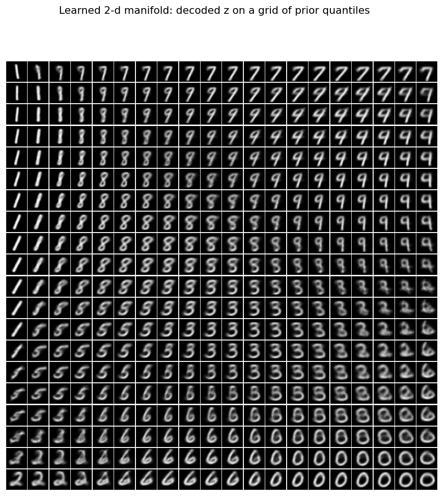
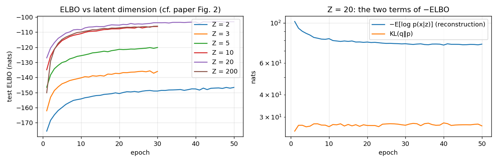
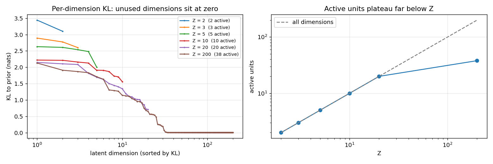
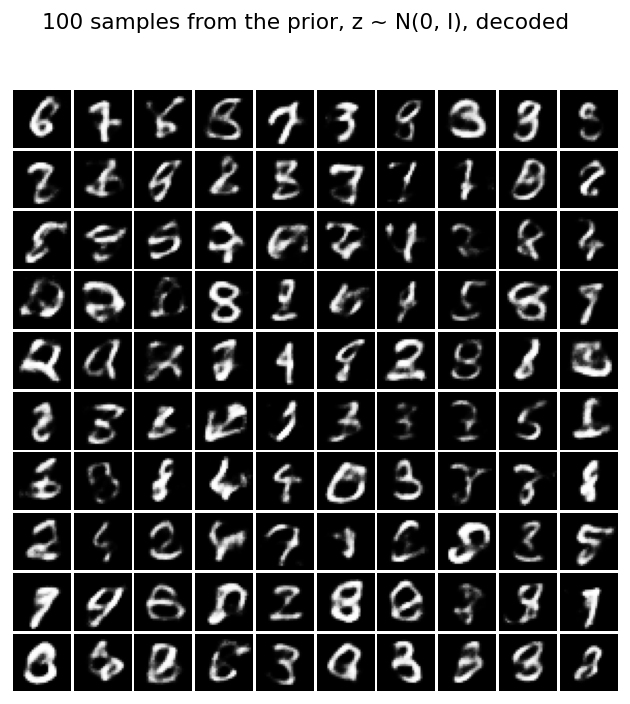
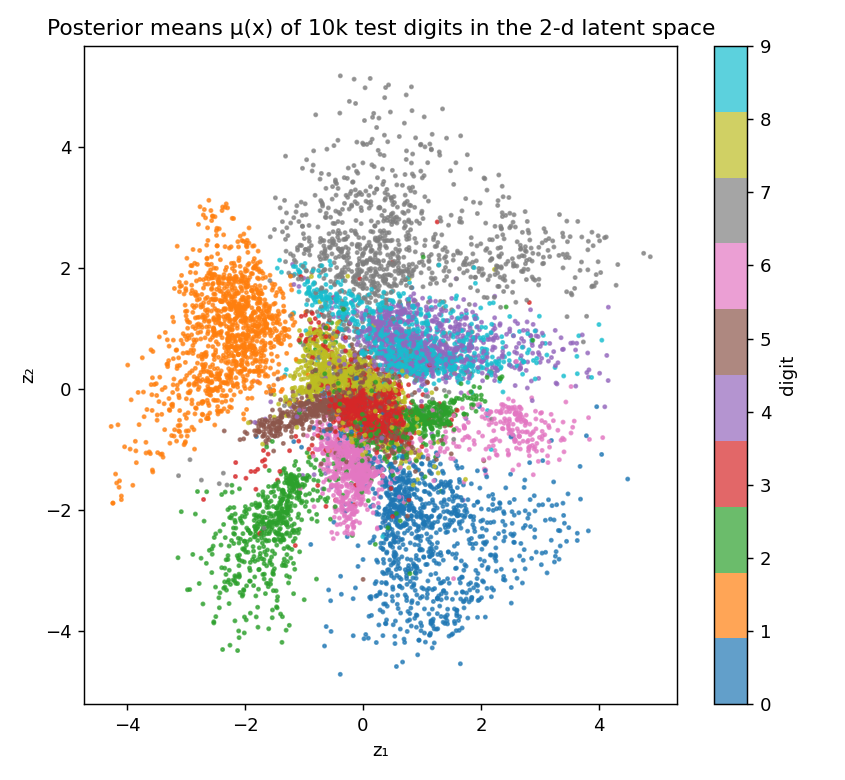
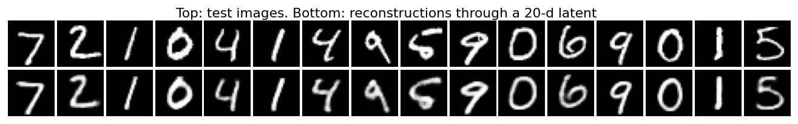

# Auto-Encoding Variational Bayes

> Kingma & Welling — 2013 — https://arxiv.org/abs/1312.6114

A from-scratch PyTorch variational autoencoder on MNIST, reproducing the paper's
lower-bound and marginal-likelihood numbers, its latent-dimension sweep, and its
2-D manifold figure, then going past it with a convolutional variant (log p(x) −90.7)
and the importance-weighted objective. The paper's setup trains in under four minutes
on a laptop CPU.

<p align="center">
  
  <br><em>A 2-dimensional latent space, decoded on a 20×20 grid of prior quantiles (paper Figure 4).
  Digits morph continuously into one another: 1 → 7 → 9 → 4 across the top, 2 → 6 → 0 along the bottom.</em>
</p>

---

## Results

### MNIST test set

| | Z = 20, this implementation | Paper (Z = 20, Fig. 2–3) |
|---|---|---|
| **log p(x), importance-weighted** | **−97.8** | ≈ −97 to −100 |
| ELBO (16-sample) | −103.1 | ≈ −100 |
| Reconstruction / KL split of the ELBO | −76.3 / 26.8 | |
| Parameters | 0.82M | same architecture (500 tanh units) |
| Training | 50 epochs, 3.4 min, 4-core CPU | Adagrad, ~10⁸ samples |

Headline numbers use all 10,000 test images and 5,000 importance samples per image from
q(z|x), the paper's own protocol (Appendix D); the sweep table below uses 2,000 images and
1,000 samples, which agrees to 0.1 nat. ELBO uses 16 posterior samples. Pixels are treated as Bernoulli
with dynamic binarisation during training.

### Latent-dimension sweep (paper Figure 2)

| Z | test ELBO | log p(x) | gap |
|---|---|---|---|
| 2 | −146.3 | −142.9 | 3.4 |
| 3 | −136.1 | −132.5 | 3.6 |
| 5 | −121.1 | −117.6 | 3.6 |
| 10 | −106.5 | −102.6 | 4.0 |
| 20 | −102.6 | **−97.7** | 4.9 |
| 200 | −105.6 | −99.4 | 6.2 |

Two of the paper's observations reproduce: the bound and the likelihood improve with Z up
to about 20, and a large latent space (Z = 200) does **not** overfit badly, because the KL
term switches off dimensions the decoder does not need (the paper's "more latent variables
does not result in more overfitting"). The ELBO-to-log p(x) gap widens with Z, meaning the
diagonal-Gaussian posterior becomes a looser fit as the latent space grows.

<p align="center"></p>

### Which latent dimensions are actually used?

| Z | active units | total KL (nats) |
|---|---|---|
| 2 | 2 | 6.5 |
| 5 | 5 | 12.3 |
| 10 | 10 | 19.4 |
| 20 | 20 | 26.8 |
| 200 | **38** | 29.8 |

A dimension is *active* if the variance of its posterior mean across the test set exceeds
0.01 (Burda et al., 2015). Every dimension is used up to Z = 20; at Z = 200 only 38 are,
and the other 162 sit exactly at the prior with zero KL. That is the mechanism behind the
paper's "no overfitting" observation, made quantitative. `active_units.py` computes it.

<p align="center"></p>

### Beyond the paper: two variants at Z = 20

| Model | Objective | Params | test ELBO | log p(x) | gap | active units | train time |
|---|---|---|---|---|---|---|---|
| MLP (paper, Appendix C) | ELBO | 0.82M | −102.6 | −97.7 | 4.9 | 20 | 3.4 min |
| MLP | IWAE, k = 5 | 0.82M | −104.0 | −96.9 | 7.1 | 20 | 6.2 min |
| Conv encoder/decoder | ELBO | 1.69M | **−97.3** | −90.7 | 6.7 | 15 | 17.9 min |
| **Conv encoder/decoder** | IWAE, k = 5 (30 ep) | 1.69M | −101.6 | **−90.1** | 11.5 | 19 | 49 min |

- **Convolutions are worth 7 nats.** Two stride-2 convs and their transposed mirror beat
  the 500-unit MLP by a wide margin at the same latent size, while using *fewer* active
  dimensions (15 vs 20): a decoder that understands local structure needs less from z.
- **IWAE trades ELBO for likelihood.** Training on the k = 5 importance-weighted bound
  (Burda, Grosse & Salakhutdinov, 2015) improves log p(x) by 0.8 nats but *lowers* the
  ELBO by 1.4, and widens the ELBO-to-log p(x) gap from 4.9 to 7.1. That is the expected
  signature: the IWAE encoder learns a broader posterior that the single-sample bound
  penalises but the importance-weighted estimate rewards. The effect size matches the
  ~1-nat gains the IWAE paper reports for k = 5 on MNIST.

### The KL weight: β-VAE and KL warm-up

All runs Z = 20, MLP, 30 epochs (so the baseline row is the paper-setup model at epoch 30,
not its final 50-epoch value).

| Run | test ELBO (β = 1) | recon | KL | log p(x) | active units |
|---|---|---|---|---|---|
| β = 0.5 | −107.1 | −71.1 | 36.5 | −102.0 | 20 |
| **β = 1 (baseline)** | **−103.7** | −76.7 | 27.0 | −97.7 † | 20 |
| β = 2 | −106.4 | −88.8 | 17.7 | −98.8 | 20 |
| β = 4 | −117.4 | −107.5 | 9.8 | −105.2 | 13 |
| β = 1, KL warm-up 10 epochs | −103.9 | −76.9 | 27.3 | −99.0 | 20 |

† log p(x) for the baseline is from its 50-epoch checkpoint; the others are 30-epoch models.

- **β = 1 is the sweet spot for likelihood**, as it should be: it is the only setting whose
  training objective is a bound on log p(x). β < 1 buys 5.6 nats of reconstruction for 9.5
  nats of KL; β > 1 does the reverse and starts switching dimensions off (13 active at β = 4).
  That trade is exactly what β-VAE sells for disentanglement, and what it costs in density.
- **KL warm-up changes nothing here.** With a 20-d MLP on MNIST there is no posterior
  collapse to prevent, so annealing β from 0 just delays training. Warm-up matters for
  strong autoregressive decoders, which this model is not.
- **Conv + IWAE (k = 5), 30 epochs: log p(x) = −90.1**, the best number in this folder, with
  19 active units versus the conv ELBO model's 15. The importance-weighted objective keeps
  more of the latent space in use.

### Samples and reconstructions

<p align="center">
  
  
  <br><em>Left: 100 decodes of z ~ N(0, I) from the Z = 20 model. Right: posterior means of 10k test
  digits in the Z = 2 model, coloured by label the model never saw.</em>
</p>

<p align="center"></p>

---

## Key Idea

We want a latent-variable generative model p(x, z) = p(z) p_θ(x|z) and its posterior
p(z|x), but the posterior is intractable for any interesting decoder. The paper's answer is
to learn an approximate posterior q_φ(z|x) with a second network (the *encoder*), and train
both networks jointly by maximising a lower bound on log p(x). The trick that makes this
work with backpropagation is the **reparameterization trick**: write z = μ + σ ⊙ ε with
ε ~ N(0, I), so the sample is a deterministic, differentiable function of the encoder's
outputs and the gradient can flow through the sampling step.

---

## Architecture (Appendix C of the paper)

```
x (784) ─► Linear 500, tanh ─► μ (Z), log σ² (Z)        encoder q_φ(z|x)
                                     │
                            z = μ + σ ⊙ ε,  ε ~ N(0, I)  reparameterization
                                     │
z (Z) ─► Linear 500, tanh ─► Bernoulli logits (784)     decoder p_θ(x|z)
```

---

## Key Equations

**The evidence lower bound (ELBO), Eq. 10**

    log p(x) ≥ L(x) = E_{q(z|x)}[ log p(x|z) ] − KL( q(z|x) ‖ p(z) )

The first term rewards reconstruction; the second keeps the posterior close to the prior so
that samples from the prior decode to sensible images.

**Closed-form KL for Gaussian q and standard-normal p, Appendix B**

    KL = −½ Σ_j ( 1 + log σ_j² − μ_j² − σ_j² )

Computing this analytically instead of by sampling removes one source of gradient variance.
`test_model.py` checks it against a 200,000-sample Monte Carlo estimate.

**Reparameterization, Section 2.4**

    z = μ(x) + σ(x) ⊙ ε,   ε ~ N(0, I)
    ∇_φ E_q[f(z)] = E_ε[ ∇_φ f(μ + σ ⊙ ε) ]

**Importance-sampled marginal likelihood, Appendix D**

    log p(x) ≈ log (1/L) Σ_i  p(x|z_i) p(z_i) / q(z_i|x),   z_i ~ q(z|x)

Always ≥ the ELBO in expectation and tighter as L grows; computed with `logsumexp`. The
implementation never materialises the L × B × 784 target tensor: with the identity
log σ(l)·x + log σ(−l)·(1−x) = x·l − softplus(l), the likelihood of L decodes against one
input is a batched dot product plus a reduction, which halves the estimator's run time on
the MLP (3.4 s → 1.8 s per 200 images × 1,000 samples). The conv model is decoder-bound;
storing its weights and activations in channels-last (NHWC) layout, which oneDNN's CPU
convolution kernels prefer, takes it from 21 s to 15 s on the same workload and shaves
10% off a training epoch, with identical outputs.

---

## Files

| File | What it is |
|---|---|
| [`model.py`](model.py) | MLP and conv encoders/decoders, reparameterization, closed-form KL, ELBO, IWAE bound, importance-sampled log p(x), sampling and reconstruction, all commented against the paper's sections |
| [`test_model.py`](test_model.py) | Ten tests: shapes; analytic KL vs Monte Carlo; gradient flow and sample statistics through the reparameterization; Bernoulli likelihood; log p(x) ≥ ELBO; ELBO rises with training; conv architecture; IWAE bound ordering L₁ = ELBO ≤ L₁₀ ≤ log p(x); β weights only the KL; batched likelihood equals the BCE form |
| [`train.py`](train.py) | MNIST training with per-epoch ELBO, reconstruction and KL |
| [`evaluate.py`](evaluate.py) | Importance-weighted log p(x) for every trained model |
| [`active_units.py`](active_units.py) | Active-unit count and per-dimension KL for every trained model |
| [`visualize.py`](visualize.py) | All figures above |
| [`results.json`](results.json) | Per-epoch history and evaluation for all six runs |

## Running it

```bash
python -m pytest test_model.py -v                 # 10 tests, ~12 s
python train.py --z-dim 20 --epochs 50            # paper's model, 3.4 min on CPU
python train.py --z-dim 2  --epochs 50            # for the manifold figure
for z in 3 5 10 200; do python train.py --z-dim $z --epochs 30; done
python train.py --z-dim 20 --arch conv --epochs 50    # conv variant, 18 min
python train.py --z-dim 20 --iwae-k 5 --epochs 50     # IWAE variant, 6 min
for b in 0.5 2 4; do python train.py --z-dim 20 --beta $b --epochs 30; done   # beta-VAE sweep
python train.py --z-dim 20 --kl-warmup 10 --epochs 30                        # KL annealing
python evaluate.py --n-test 2000 --samples 1000   # ~5 min for all eight models
python active_units.py
python visualize.py
```

---

## What I Learned

- **The KL term is a learned bottleneck.** With Z = 200 the KL settles at about 30 nats,
  barely above Z = 20's 27, because only 38 dimensions are active: the encoder drives the
  variance of the other 162 to 1 and their mean to 0, paying zero KL for them. This is why
  the model does not overfit as Z grows.
- **The KL weight is a dial between density and compression.** β is a Lagrange multiplier
  on the rate term: lowering it spends KL on reconstruction, raising it prunes dimensions.
  Only β = 1 is a likelihood bound, and it wins on log p(x); every other setting is buying
  something else with nats.
- **A tighter training bound is not a better ELBO.** The IWAE model has the best MLP
  log p(x) and the worst MLP ELBO at Z = 20. Which number you optimise changes what the
  encoder learns; compare models on log p(x), not on the bound they were trained with.
- **Analytic KL matters.** Estimating the KL by sampling adds variance to every gradient
  step; the closed form makes the one-sample ELBO estimator good enough to train on, which is
  the paper's Section 2.4 point about the SGVB estimator.
- **Dynamic binarisation is quiet data augmentation.** Resampling x ~ Bernoulli(intensity)
  each minibatch keeps train and test ELBO within 5 nats after 50 epochs.
- **The manifold grid needs the inverse CDF.** Spacing the 2-D grid linearly wastes most
  tiles on the prior's tails; mapping uniform quantiles through Φ⁻¹ covers the mass evenly
  and gives the paper's figure.
- **Logits everywhere.** Computing the Bernoulli likelihood from logits with
  `binary_cross_entropy_with_logits` avoids log(0) when the decoder becomes confident.

## Resume-ready summary

> Implemented a variational autoencoder from scratch in PyTorch (Kingma & Welling, 2013),
> including the reparameterization trick, closed-form Gaussian KL and an importance-sampled
> marginal-likelihood estimator; reproduced the paper's MNIST results (log p(x) = −97.8 nats
> at Z = 20) and its latent-dimension sweep in under 20 minutes of laptop-CPU training;
> extended it with a convolutional variant reaching −90.7 nats and the importance-weighted
> (IWAE) objective, and quantified latent usage with an active-units analysis showing a
> 200-d model uses 38 dimensions.
