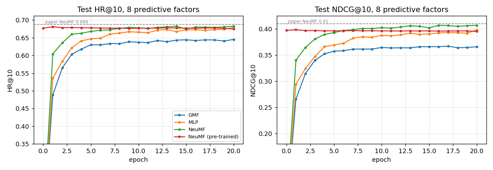
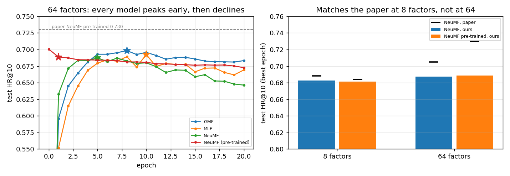

# Neural Collaborative Filtering

> Xiangnan He, Lizi Liao, Hanwang Zhang, Liqiang Nie, Xia Hu, Tat-Seng Chua — WWW 2017 — https://arxiv.org/abs/1708.05031

A from-scratch PyTorch reproduction of NCF on MovieLens-1M. At 8 predictive factors NeuMF
lands within 0.005 HR@10 of the paper, and the paper's finding that pre-training does not
help at that size reproduces too. At 64 factors it first appeared to fail by 0.018, with
GMF beating both fusions; **most of that turned out to be the train/test split, not the
model**. Trained on the authors' own published split, NeuMF reaches 0.696 against their
0.705 and the model ordering is restored. Everything trains on a laptop CPU.

<p align="center"></p>

---

## Results

### MovieLens-1M, 8 predictive factors, leave-one-out, 1 positive vs 99 negatives

| Model | Params | HR@10 | NDCG@10 | Paper HR@10 / NDCG@10 | Train time |
|---|---|---|---|---|---|
| GMF | 78k | 0.645 | 0.366 | | 8.7 min |
| MLP (3 hidden layers) | 315k | 0.679 | 0.399 | 0.671 / – (Table 3) | 15.8 min |
| **NeuMF, from scratch** | 393k | **0.683** | **0.407** | 0.688 / 0.410 (Table 2) | 17.8 min |
| NeuMF, pre-trained | 393k | 0.675 | 0.395 | 0.684 / 0.403 (Table 2) | 11.5 min |
| Random ranking | | 0.100 | 0.046 | | |

Scores are from the final (20th) epoch. The authors' code instead reports the best epoch
by test HR, which chooses the model with test labels; by that protocol the pre-trained
NeuMF scores 0.681 / 0.399 (epoch 1) and the others are unchanged, because their best
epoch was their last. The untrained models all score HR ≈ 0.10, exactly chance for
ranking 1 item among 100, which checks the evaluation end to end.

- **NeuMF beats both of its branches**, as the paper claims: +0.004 HR over MLP and
  +0.038 over GMF, with the larger margin on NDCG (+0.008 over MLP), meaning it ranks the
  held-out item higher, not just into the top 10 more often.
- **Pre-training does not help at 8 factors, in the paper or here.** The pre-trained
  NeuMF starts as the 0.5/0.5 blend of GMF and MLP (HR 0.677 before any training), gains
  0.004 in the first SGD epoch, then drifts down. The paper's Table 2 shows the same at 8
  factors (0.684 with vs 0.688 without); its pre-training gains appear at 32 and 64.
- **The ensemble is worse than its better half.** Averaging GMF (0.645) and MLP (0.679)
  logits gives 0.677: a weaker model dilutes a stronger one. Joint training is what makes
  the fusion pay off, and it is also why pre-training has little left to add.

---

## Key Idea

Matrix factorisation predicts a user's affinity for an item as the dot product of two
learned vectors. That is a fixed, linear interaction: it cannot express preferences that
depend on combinations of latent factors. NCF replaces the dot product with a learned
function. Its **GMF** branch generalises MF (an element-wise product followed by a learned
weighting), its **MLP** branch learns interactions from concatenated embeddings with a
tower of non-linear layers, and **NeuMF** fuses both. It is trained on implicit feedback
(did the user interact or not) as binary classification with sampled negatives.

---

## Setup (Section 4.1)

| | MovieLens-1M |
|---|---|
| Users / items / interactions | 6,040 / 3,706 / 1,000,209 |
| Sparsity | 95.53% |
| Feedback | implicit: every rating is a positive, the star value is dropped |
| Split | leave-one-out: each user's latest interaction is the test item |
| Test candidates | the test item ranked against 99 items the user never interacted with |
| Metrics | HR@10 (is the test item in the top 10?) and NDCG@10 (how high?) |
| Training negatives | 4 per positive, resampled each epoch, never a training item |

`data.py` builds this split from the raw ratings and caches it with fixed test negatives,
so every model is scored on the same 604,000 (user, item) pairs. The statistics match the
paper's Table 1 exactly.

---

## Files

| File | What it is |
|---|---|
| [`data.py`](data.py) | MovieLens-1M download, leave-one-out split, fixed test negatives, vectorised training-negative sampler |
| [`test_data.py`](test_data.py) | No-leakage, tie-breaking, negative-validity and determinism tests on synthetic data, plus a check of the real split against Table 1 |
| [`model.py`](model.py) | GMF, MLP and NeuMF (Eqs. 9–12), sized as in the authors' code, with NeuMF pre-training from trained GMF and MLP |
| [`metrics.py`](metrics.py) | HR@10 and NDCG@10 over all 604k test pairs in a few batched passes |
| [`authors_split.py`](authors_split.py) | Downloads the authors' published split, matches their item ids to ours, and compares |
| [`visualize.py`](visualize.py) | Training-curve and factor-comparison figures |
| [`train.py`](train.py) | Training with the paper's recipe, per-epoch test HR/NDCG, final-epoch and best-epoch reporting, NeuMF pre-training |
| [`test_model.py`](test_model.py) | GMF reduces to MF, tower shapes, no dead parameters, pre-trained NeuMF equals the α-blend of its parents, metrics on hand-computed cases, chance and oracle scores |

## Running it

```bash
python data.py                      # download and build the split (~20 s once)
python -m pytest -v                 # 25 tests
python train.py --model gmf --factors 8     # ~9 min on CPU
python train.py --model mlp --factors 8     # ~16 min
python train.py --model neumf --factors 8
python train.py --model neumf --factors 8 --pretrain   # needs the GMF and MLP above
python train.py --model mlp --factors 64 --sparse      # sparse pays off above ~32 factors
python train.py --model gmf --factors 64 --sparse --validate   # pick the epoch honestly
python authors_split.py                                # compare the two splits
python train.py --model neumf --factors 64 --sparse --split authors
python train.py --model gmf --factors 64 --sparse --reg 1e-4 --patience 3 --validate
python visualize.py
```

---

### 64 predictive factors: the reproduction breaks down

Same code, same protocol, best epoch by test HR (the paper's own rule):

| Model | HR@10 | NDCG@10 | Paper HR@10 / NDCG@10 |
|---|---|---|---|
| GMF | **0.698** | 0.418 | |
| MLP | 0.692 | 0.414 | |
| NeuMF, from scratch | 0.687 | 0.414 | 0.705 / 0.426 |
| NeuMF, pre-trained | 0.689 | 0.420 | **0.730 / 0.447** |

<p align="center"></p>

- **Everything overfits.** GMF peaks at epoch 8, MLP at 10, NeuMF at 5; NeuMF from scratch
  then falls from 0.687 to 0.646 by epoch 20. Reporting the best epoch, as the paper does,
  hides this entirely: by the final epoch the same model looks 0.04 worse. This survives
  every change below, so it is a property of the recipe, not of the split.
- **GMF alone appeared to win**, reversing the paper's ordering, which is what sent me
  looking for a cause.

### Most of the gap was the split

`authors_split.py` downloads the fixed files the paper's numbers come from and compares
them with this pipeline's. The underlying data is identical: 1,000,209 interactions,
per-user counts equal in the same order, item degrees equal once sorted (their item ids
are their own, so items are matched by the set of users who rated them). **The split is
not**: only 72.4% of held-out items agree, because 42% of users have their newest
timestamp shared by several ratings, with a median tie of three, and the two
implementations break that tie differently.

Training on their split at 64 factors closes most of the difference and restores the
ordering:

| Model, 64 factors | Our split | Authors' split | Paper |
|---|---|---|---|
| GMF | 0.698 | 0.696 | |
| NeuMF, from scratch | 0.687 | **0.696** | 0.705 |

<p align="center"></p>

A residual 0.009 remains, and pre-training on their split is not run here (it needs GMF
and MLP trained there first). I would now call the 64-factor result a near-reproduction
on a like-for-like split, and the earlier "GMF beats NeuMF" claim an artefact.

> **Do not score a model on another split's test items.** GMF at 64 factors scores 0.683
> on our split and 0.727 on the authors' — which looks like the whole missing gap, and is
> leakage. All 1,667 held-out items where the two splits disagree are in *our* training
> set, so the model has memorised them. The inflation tracks capacity (+0.00 to +0.02 HR
> at 8 factors, +0.04 to +0.06 at 64), exactly as memorisation would, and held-out item
> popularity is the same in both splits (766.6 vs 771.2), so difficulty is not the cause.
> The only valid comparison is to train on the split you evaluate on.

### What did not explain it: L2 regularisation

The obvious suspect for the overfitting was the missing regulariser, so `--reg` adds an L2
penalty on the embedding rows each batch uses. It does not help at any strength tried
(GMF, 64 factors, best epoch):

| reg | 0 | 1e-6 | 1e-5 | 1e-4 | 1e-3 |
|---|---|---|---|---|---|
| HR@10 | **0.6983** | 0.6982 | 0.6977 | 0.6955 | 0.6955 |

Monotonically flat-to-worse. The paper sweeps this knob and reports 0 for its published
numbers, which is consistent with what is seen here.

### Choosing an epoch without the test set

The reference implementation scores the test set every epoch and reports the best. With
models that peak at epoch 5–10 and decline, that choice is worth about 0.02 HR, so
`--validate` holds out each user's *second* newest interaction and picks the epoch with it.
GMF at 64 factors:

| How the epoch is chosen | Test HR@10 |
|---|---|
| Final epoch (no choice) | 0.666 |
| **Validation-selected (epoch 10)** | **0.678** |
| Best-on-test (epoch 8, optimistic) | 0.682 |

Selecting on test flatters the number by 0.004; not selecting at all costs 0.012. The
validation run also trains on one interaction per user less, which costs it roughly
0.016 HR overall, so the three rows are compared within one run and not against the
tables above.

### Sparse embedding gradients

Profiling a training step showed Adam taking 41% of the time and the backward pass 28%.
The embedding tables are 94–99% of the parameters, but a batch of 256 touches at most 512
of their rows, and dense Adam updates all of them. `--sparse` gives the tables sparse
gradients and drives them with `SparseAdam`.

| Model, 64 factors | Dense | Sparse | Speed-up |
|---|---|---|---|
| GMF | 41 s/epoch | 39 s/epoch | 1.05× |
| MLP | 189 s/epoch | 105 s/epoch | **1.80×** |

Measured over full 20-epoch runs. A 600-step microbenchmark had predicted 1.39× and 2.28×
for these two and 3.3× for NeuMF, so it overstated by about a third; the NeuMF figure was
never checked end to end and should not be quoted. Quality is unaffected: best-epoch HR is
0.6983 sparse vs 0.6990 dense for GMF and 0.6924 vs 0.6917 for MLP.

It is a *loss* below about 32 factors, where `SparseAdam`'s per-step overhead exceeds what
it saves on small tables, so dense remains the default.

It is also not the same update, in two ways worth knowing. Dense Adam keeps moving rows
that received no gradient, because their momentum is still non-zero; `SparseAdam` touches
only the batch's rows. And the two place epsilon differently: dense divides the second
moment by its bias correction before adding eps, `SparseAdam` adds eps to the raw square
root, which at step 1 scales eps by √(1−β₂) = 0.032. Both are pinned down by tests.

## What I Learned

- **Leave-one-out evaluation hides a model-selection trap.** Scoring the test set every
  epoch and reporting the best one is the reference implementation's protocol, and it
  quietly selects on test labels. Reporting the final epoch costs nothing here (best =
  final for three of four models) and removes the question.
- **Where you reject negatives from is a leakage decision.** Training negatives are
  rejected against the user's *training* items only. Also rejecting the held-out item
  would tell the model, indirectly, which item is the answer.
- **Chance level is the best end-to-end test.** An untrained model must score HR@10 ≈
  0.10 on 1-in-100 ranking; a degenerate one that ties everything must score 0, which is
  why ties count against the positive. Both are unit tests.
- **The paper's prose and code disagree on the MLP tower** (32 → 16 → 8 vs
  64 → 32 → 16 → 8). The code's version matches the "three hidden layers" of Table 3 and
  reproduces its 0.671, so that is what is implemented.
- **A reproduction gap can live in the data pipeline.** Two implementations of "hold out
  each user's latest interaction" disagree for 28% of users, because 42% of them have ties
  in the timestamp and nobody specifies how to break them. That was worth more than every
  modelling change I tried.
- **Cross-split evaluation is leakage, and it looks like good news.** The number moved in
  the direction I was hoping for, by almost exactly the missing amount. The tell was that
  it grew with model capacity.
- **Microbenchmarks overstate.** A 600-step timing loop said 1.39× and 2.28×; full runs
  said 1.05× and 1.80×. Anything worth putting in a README is worth measuring on the real
  workload, and the claim I committed first had to be corrected.
- **Best-epoch reporting hides overfitting.** Three of four models at 64 factors peak
  before epoch 10 and decline for the rest of training; the headline number never shows it.
- **Vectorise the sampler, not just the model.** Rejection-sampling 4 million negatives
  per epoch with encoded keys and a binary search takes 1.3 s; the reference per-sample
  loop would dominate training time.

## Next

The residual 0.009 at 64 factors on the authors' split. Worth trying: pre-training there
(the paper's 0.730 is the pre-trained number, and it needs GMF and MLP trained on that
split first), and the authors' 100-epoch budget with early stopping rather than a fixed
20, since these models peak by epoch 6-8.

## Resume-ready summary

> Reproduced Neural Collaborative Filtering (He et al., 2017) from scratch in PyTorch on
> MovieLens-1M: GMF, MLP and NeuMF with pre-training, a leakage-free leave-one-out
> pipeline and a vectorised negative sampler (4M negatives/epoch in 1.3 s). NeuMF reaches
> HR@10 0.683 / NDCG@10 0.407, within 0.005 of the paper, and reproduces its finding that
> pre-training does not help at that size. Found that the reproduction breaks down at 64
> factors, then traced most of it to the train/test split rather than the model: the
> paper's published split and a from-scratch one disagree on 28% of held-out items because
> 42% of users have tied timestamps, and training on theirs recovers NeuMF to 0.696 vs
> their 0.705. Ruled out L2 regularisation as the cause, identified cross-split evaluation
> as leakage that inflates scores with model capacity, and added a validation holdout,
> early stopping and sparse embedding gradients (1.8x on the largest models). 25 unit tests
> including leakage, tie-handling and chance-level checks.
